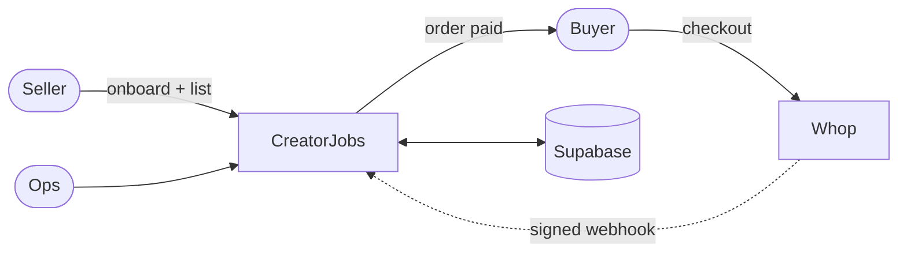

# CreatorJobs

CreatorJobs is a minimal two-sided marketplace: businesses buy work from verified creator sellers. Payments run on Whop connected accounts with platform application fees; Supabase holds marketplace state and webhook audit history.

## Architecture



```text
Buyer → CreatorJobs order (pending_payment) → Whop hosted checkout (seller child company)
     → Whop webhook (verified) → order paid → seller payout readiness → admin ops
```

The dashed arrow is the key reliability property: an order only becomes `paid` when Whop's **signed webhook** arrives, never from the checkout redirect.

Whop is source of truth for payments, verification, and payout state. Supabase is source of truth for sellers, listings, orders, and webhook records.

### Connected accounts

Each seller is a **child Whop company** under the CreatorJobs platform company (`parent_company_id`). Buyers pay through hosted checkout on the seller company (direct charge). CreatorJobs collects `application_fee_amount` from `PLATFORM_FEE_BPS`.

### Alternative: transfer / escrow model

Buyer pays platform → platform transfers seller share later. Use when CreatorJobs needs escrow-like control or release-after-delivery. Direct charges fit open marketplace listings where the seller owns disputes/refunds.

## Local setup

1. Clone and install:

```bash
npm install
```

2. Copy env and fill values:

```bash
cp .env.example .env.local
```

3. Apply database schema in Supabase SQL editor: [`supabase/schema.sql`](supabase/schema.sql)

4. Verify Whop sandbox access:

```bash
npm run preflight
```

5. Start dev server:

```bash
npm run dev
```

6. For Whop return URLs, use an HTTPS tunnel and set `NEXT_PUBLIC_APP_URL` to the tunnel URL (not a random Vercel preview URL).

## Whop sandbox setup

1. Create sandbox account at [sandbox.whop.com](https://sandbox.whop.com)
2. Generate Company API key at Developer settings
3. Set `WHOP_API_KEY` and `WHOP_PLATFORM_COMPANY_ID`
4. Ensure Platforms access for child company creation
5. Register webhook:

```bash
npm run setup-webhook
```

Paste `WHOP_WEBHOOK_SECRET` into `.env.local`. **Enable `child_resource_events: true`** — without it, seller payments never webhook to the platform.

## Experimental endpoints

See [`docs/API-NOTES.md`](docs/API-NOTES.md). Stable SDK methods are used where Experimental has no SDK binding; fallbacks in [`BLOCKERS.md`](BLOCKERS.md).

## Order state machine

```text
pending_payment → paid | failed
paid → refunded
```

Only verified webhooks transition to `paid`. Checkout redirect shows “Confirming payment…” and polls every 2s.

## Webhook flow

```text
Verify signature → persist raw event → dedupe by webhook-id → process → mark processed/failed
```

## Payout readiness

Three independent fields: `kyc_status`, `payout_method_linked`, `payout_eligible`.

## Demo

1. Switch role to **Seller** → `/sell` → create account → onboarding → Check status
2. `/sell/listings` → create listing
3. Switch to **Buyer** → homepage → checkout with test card `4242 4242 4242 4242`
4. Order page stays pending until webhook
5. `/sell/payouts` and `/admin` for ops


Seed demo seller (optional):

```bash
npm run seed
```

## Known limitations

- Sandbox payouts may be incomplete ([Whop sandbox guide](https://docs.whop.com/developer/guides/sandbox))
- Cookie role switcher is demo-only; production needs real auth
- Demo-only verified seller is labeled and not Whop-verified

## Tools

- Next.js App Router, TypeScript strict, Tailwind, Supabase, `@whop/sdk`, Vercel

## Support runbook

See [`RUNBOOK.md`](RUNBOOK.md).
